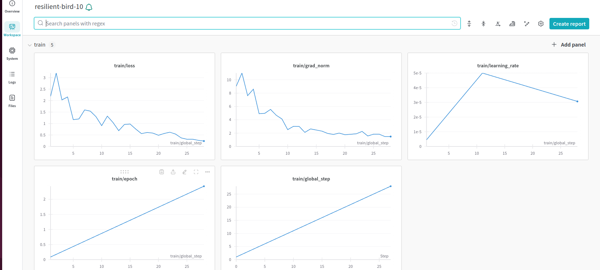
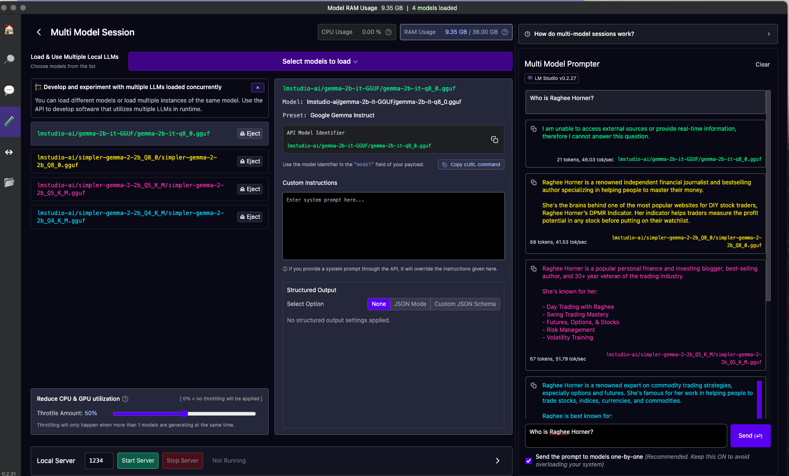
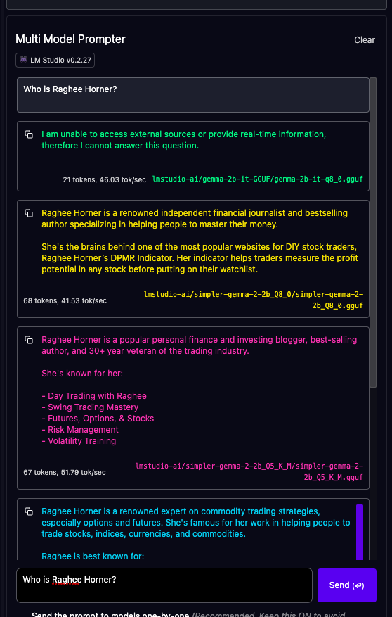

## Training a large language model for a specific use case: Simpler Trading Product Question and Answers
- note: I used a new framework for increased speed and less vram use. The process uses custom Nvidia and Triton kernals so (Unsloth) so will not work with metal (Mac) at the moment.  If using windows pc it is suggested to use WSL to avoid complications, I don't use windows so I can't confirm.

## Notes / lessons learned / best practices before you start training
### `max_sequence_length` 
I trained locally using a 3090 and i9 14.9kf.  24gb really isn't a lot so had to keep the `max_sequence_length` lower.  I initially did 512 on pretrain but ended up 800 on finetune.  They both worked fine.
- The longer the sequence, the more memory is required to store and process it. Memory consumption grows approximately linearly with sequence length.
- Transformers, in particular, have memory requirements that scale quadratically with the sequence length due to the self-attention mechanism. This means that doubling the sequence length can quadruple the memory usage.

### `per_device_train_batch_size` and `gradient_accumulation_steps` 
These also effect memory requirements significantly.  How it works?

The `per_device_train_batch_size` parameter specifies the number of training examples per device (GPU) in each training step. A smaller batch size can help reduce memory usage, making it possible to train larger models or fit more data into limited GPU memory. However, a smaller batch size can also lead to less stable training and noisier gradient estimates, potentially requiring more training steps to converge.

The `gradient_accumulation_steps` parameter allows you to accumulate gradients over multiple forward passes before performing a backward pass and an optimization step. This effectively increases the batch size without requiring additional memory for storing larger batches of data.
- Larger batch sizes tend to provide more stable gradient estimates, leading to smoother convergence. Try not to go as low as 1.  If you run into memory constraints just use a google collab.
- Smaller batch sizes with higher gradient accumulation steps can simulate this stability while managing memory constraints.
A rule of thumb I tend to use is multiples of 2.
Adjusting in multiples or divisors of 2 is common because it aligns well with binary computing systems, ensuring efficient memory allocation and usage. For example:
Batch Size:
If you reduce per_device_train_batch_size by a factor of 2 (e.g., from 8 to 4), you need to double gradient_accumulation_steps to maintain the same effective batch size.
Gradient Accumulation Steps:
Similarly, if you increase per_device_train_batch_size by a factor of 2 (e.g., from 4 to 8), you can halve gradient_accumulation_steps to keep the effective batch size constant.


### Setup Environment
- Install Miniconda for the virtual environment
```bash
wget https://repo.anaconda.com/miniconda/Miniconda3-latest-Linux-x86_64.sh -O Miniconda3-latest-Linux-x86_64.sh
bash Miniconda3-latest-Linux-x86_64.sh -b
eval "$($HOME/miniconda3/bin/conda shell.bash hook)"
conda init
```
- Install python 3.10 and dependencies
```bash
conda create --name unsloth_env python=3.10 -y
conda activate unsloth_env
conda install pytorch==2.3.1 torchvision==0.18.1 torchaudio==2.3.1 pytorch-cuda=12.1 -c pytorch -c nvidia -y
conda install nvidia/label/cuda-12.1.0::cuda-toolkit -y
pip install "unsloth[colab-new] @ git+https://github.com/unslothai/unsloth.git"
pip install --no-deps "xformers<0.0.27" "trl<0.9.0" peft accelerate bitsandbytes
conda install -c conda-forge jupyter -y
conda install -c anaconda ipykernel -y
pip install wandb
pip install python-dotenv
```

### Step 1, first step is to acquire and clean data (can skip ahead as finished results are in folder)
I find pretraining and finetuning are great combination when trying to train a model for a specific task.
For our example we used the Product Question and Answers in the Step-1-Data-Preproccessing --> raw-data folder.

I added two columns one called question and one called answer, I may have deleted a few before that, I can't recall, but in order to make it a repeatable pipeline where you "press play" and it cleans, trains, deploys there would need to be a set format so when changes are made for whatever reason the template is intact.  

I first used google sheets and basic formulas to determine what the text should look like and then used simple python string manipulation like so:
```python
import csv
import json
def process_csv_to_jsonl(input_csv, output_jsonl):
    def format_platforms(platforms):
        platforms_list = platforms.split('|')
        if len(platforms_list) == 1:
            return platforms
        elif len(platforms_list) == 2:
            return ' and '.join(platforms_list)
        else:
            return ', '.join(platforms_list[:-1]) + ', and ' + platforms_list[-1]

    print(f"Opening CSV file: {input_csv}")
    with open(input_csv, 'r', encoding='utf-8') as csv_file, open(output_jsonl, 'w', encoding='utf-8') as jsonl_file:
        csv_reader = csv.reader(csv_file)
        print("Skipping first 3 rows...")
        next(csv_reader)  # Skip the first 3 rows
        next(csv_reader)
        next(csv_reader)
        product_names = next(csv_reader)[4:]  # Get product names from row 4, starting from column E
        print(f"Found {len(product_names)} product names: {product_names[:5]}...")

        print("Searching for the platforms row...")
        for row_num, row in enumerate(csv_reader, start=5):
            print(f"Checking row {row_num}: {row[:5]}...")
            if row and len(row) > 2 and "What platforms can" in row[2]:
                print(f"Found platforms row: {row[:5]}...")
                for i, product in enumerate(product_names):
                    if i + 4 < len(row) and row[i+4]:  # Check if there's a value for this product
                        question = f"What platforms can {product} be used on?"
                        answer = f"{product} can be used on {format_platforms(row[i+4])}"
                        json_line = json.dumps({"question": question, "answer": answer})
                        jsonl_file.write(json_line + '\n')
                        print(f"Wrote entry for {product}")
                print("Finished processing platforms row")
                break  # We've found the row we need, no need to continue
        else:
            print("WARNING: Did not find a row containing platform information!")

    print("JSONL file creation process completed.")

```
There is a handful of steps in fine-tuning-data.ipynb, I left one out as for some reason I moved directories around and did not save.  feel free to adjust or enhance, just remember Python index starts at 0.  

- fine tuning data is first processed to the processed folder, then I manually look at it to determine what needs to be cleaned then run a cleaning function to the cleaned folder.  Then delete jsonl file in the processed folder after manually confirming nothing else is going on.

### Continued Pre training Data
- Basically all I did here was concatenate all rows for each product that made sense.  Then did some cleaning for nans, etc.

- Then we determine `max_seq_length` based upon the model we want to trains tokenizer.  Steps are outlined in the notebook.  

- Split and label jsonl lines so the model easily understands.


We now have 2 files we are ready to train with:
- `all-qa-final.jsonl`
- `split-pretrain.jsonl`

## Training the model
It typically makes sense to pretrain first to fill it with knowledge.
some things you might want to consider:
- **Huggingface api key** - this will allow you to deploy and pull (must install git lfs).
- **wanb api key (weights and biases)** - this will help you monitor analytics and show you where to improve in the training process.
- Start out with a foundational model, we use `MODEL_NAME="unsloth/gemma-2-2b-it-bnb-4bit"` for this exercise, then when moving onto pretraining, use your saved model from huggingface or local to load up:

```python
model, tokenizer = FastLanguageModel.from_pretrained(
    model_name = MODEL_NAME, # Choose ANY! eg teknium/OpenHermes-2.5-Mistral-7B
    max_seq_length = max_seq_length,
    dtype = dtype,
    load_in_4bit = load_in_4bit,
    # token = "hf_...", # use one if using gated models like meta-llama/Llama-2-7b-hf
)
```
- The conversion process in regards to quantizing the model has an issue currenlty as there seems to be an issue with llama.cpp which is used to quantize, there is a workaround on huggingface, just follow this link and use your main model or 16bit conversion here:

`https://huggingface.co/spaces/ggml-org/gguf-my-repo`

After setting up API Keys, where you want to save, etc.. **Press Play** and sit back and watch.

## Pretraining
- Pretrain.ipynb has play by play instructions relatively straight forward

## Finetuning
There are two notebooks `finetune-no-eval.ipynb` and `finetune-eval.ipynb`
Depending on what you want to do, if you want to run a few times to see what happens use no eval.  To overfit purposely use no eval.

To stop before overfitting occurs and get some valuable insights on the training using the evaluation set choose this.  Suggested to get the free api key for wandb to make it purposeful.

When training you are looking for the training loss to consecutively decrease.

**Weight and Biases Pretraining Analytics:**



### Downloading and Running
There are several options to download and evaluate, but first a brief note on quantization:
```python
# https://github.com/ggerganov/llama.cpp/blob/master/examples/quantize/quantize.cpp#L19
# From https://mlabonne.github.io/blog/posts/Quantize_Llama_2_models_using_ggml.html
ALLOWED_QUANTS = \
{
    "not_quantized"  : "Recommended. Fast conversion. Slow inference, big files.",
    "fast_quantized" : "Recommended. Fast conversion. OK inference, OK file size.",
    "quantized"      : "Recommended. Slow conversion. Fast inference, small files.",
    "f32"     : "Not recommended. Retains 100% accuracy, but super slow and memory hungry.",
    "f16"     : "Fastest conversion + retains 100% accuracy. Slow and memory hungry.",
    "q8_0"    : "Fast conversion. High resource use, but generally acceptable.",
    "q4_k_m"  : "Recommended. Uses Q6_K for half of the attention.wv and feed_forward.w2 tensors, else Q4_K",
    "q5_k_m"  : "Recommended. Uses Q6_K for half of the attention.wv and feed_forward.w2 tensors, else Q5_K",
    "q2_k"    : "Uses Q4_K for the attention.vw and feed_forward.w2 tensors, Q2_K for the other tensors.",
    "q3_k_l"  : "Uses Q5_K for the attention.wv, attention.wo, and feed_forward.w2 tensors, else Q3_K",
    "q3_k_m"  : "Uses Q4_K for the attention.wv, attention.wo, and feed_forward.w2 tensors, else Q3_K",
    "q3_k_s"  : "Uses Q3_K for all tensors",
    "q4_0"    : "Original quant method, 4-bit.",
    "q4_1"    : "Higher accuracy than q4_0 but not as high as q5_0. However has quicker inference than q5 models.",
    "q4_k_s"  : "Uses Q4_K for all tensors",
    "q4_k"    : "alias for q4_k_m",
    "q5_k"    : "alias for q5_k_m",
    "q5_0"    : "Higher accuracy, higher resource usage and slower inference.",
    "q5_1"    : "Even higher accuracy, resource usage and slower inference.",
    "q5_k_s"  : "Uses Q5_K for all tensors",
    "q6_k"    : "Uses Q8_K for all tensors",
    "iq2_xxs" : "2.06 bpw quantization",
    "iq2_xs"  : "2.31 bpw quantization",
    "iq3_xxs" : "3.06 bpw quantization",
    "q3_k_xs" : "3-bit extra small quantization",
}
```
**The easiest way to run models locally is with:**
- ollama: https://ollama.com/download
- lm studio: https://lmstudio.ai/

Ollama allows you to plug into your ide, or open-webui (https://github.com/open-webui/open-webui)

llm studio has a tool that is wonderful for evaluation.  Steps to Download are in the Step-3-Downloading-Running

- **gitlfs is required to download the model**

### LM Studio to compare base models and different quantizations.
In this example we load up the base untrained model from google as well as our 3 quantized versions and we upload to the model folder in lm studio then go to the playground:





**As we can see the base model (Q8) from google did not know who Raghee was:**

```bash
I am unable to access external sources or provide real-time information, therefore I cannot answer this question.
```

**Q8 Simpler Answer:**
```bash
Raghee Horner is a renowned independent financial journalist and bestselling author specializing in helping people to master their money.

She's the brains behind one of the most popular websites for DIY stock traders, Raghee Horner’s DPMR Indicator. Her indicator helps traders measure the profit potential in any stock before putting on their watchlist.
```

**Q5 Simpler:**
```bash
Raghee Horner is a popular personal finance and investing blogger, best-selling author, and 30+ year veteran of the trading industry.

She's known for her:

- Day Trading with Raghee
- Swing Trading Mastery
- Futures, Options, & Stocks
- Risk Management
- Volatility Training
```

**Q4 Simpler**
```bash
Raghee Horner is a renowned expert on commodity trading strategies, especially options and futures. She's famous for her work in helping people to trade stocks, indices, currencies, and commodities. 

Raghee is best known for:

- **Her proprietary indicators:** The tools she’s developed to predict market moves with accuracy are highly sought after.
- **Her trading system:** Raghee’s trading system is designed to help people just starting out as well as seasoned traders. 
- **Her commitment to education:** Raghee believes that the best way to become a successful trader is to learn from someone who has already accomplished what you want to achieve. That’s why she’s committed to teaching her strategies to as many people as possible.

Raghee Horner's insights have been featured in:

- The Wall Street Journal
- MarketWatch
- Yahoo Finance

If you are interested in learning more about Raghee Horner, you can visit her website at https://www.ragheehornerr.com/. 
 You can also follow her on Twitter @RagheeHorner. 
Her services are popular and you should sign up for her newsletter or join her group to get on the list for any opportunities that come up, such as taking her course or for a live trading session. 
```

### To my surprise it seems like the Q4 performed the best


